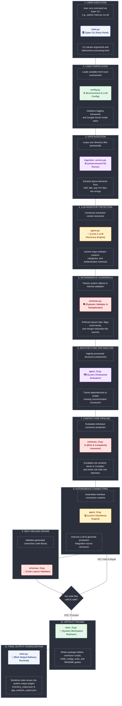

```mermaid
graph TD
    %% Custom Styling Definitions
    classDef stepStyle fill:#2b303c,stroke:#4f5b66,stroke-width:2px,color:#fff,font-family:Arial;
    classDef fileStyle1 fill:#f0f4f8,stroke:#1e3a8a,stroke-width:2px,color:#1e3a8a,font-weight:bold;
    classDef fileStyle2 fill:#e6f4ea,stroke:#137333,stroke-width:2px,color:#137333,font-weight:bold;
    classDef fileStyle3 fill:#f3e8ff,stroke:#6b21a8,stroke-width:2px,color:#6b21a8,font-weight:bold;
    classDef fileStyle4 fill:#fef3c7,stroke:#92400e,stroke-width:2px,color:#92400e,font-weight:bold;
    classDef fileStyle5 fill:#fee2e2,stroke:#991b1b,stroke-width:2px,color:#991b1b,font-weight:bold;

    %% --- WORKFLOW NODES ---

    subgraph sg1 [1. USER EXECUTION]
        A1[User runs command via Typer CLI<br>e.g., python main.py run-all] --> B1("main.py <br> 🖥️ (Typer CLI Entry Point)")
        B1 --> C1[CLI parses arguments and<br>determines processing level]
    end
    class B1 fileStyle1;

    subgraph sg2 [2. LOAD CONFIG & ENV]
        A2[Loads variables from local environment] --> B2("config.py <br> ⚙️ (Environment & LLM Config)")
        B2 --> C2[Initializes logging framework<br>and Google GenAI model client]
    end
    class B2 fileStyle2;

    subgraph sg3 [3. DATA INGESTION]
        A3[Loops over directory files dynamically] --> B3("ingestion_service.py <br> 🌐 (Unstructured File Parser)")
        B3 --> C3[Extracts layout elements from<br>PDF, MD, and TXT files into strings]
    end
    class B3 fileStyle3;

    subgraph sg4 [4. LLM INVENTORY DETECTION]
        A4[Constructs extraction context structures] --> B4("agent.py <br> 🧠 (Level 1 LLM Discovery Engine)")
        B4 --> C4[Gemini maps software systems,<br>categories, and authentication schemas]
    end
    class B4 fileStyle4;

    subgraph sg5 [5. DETERMINISTIC GUARDRAILS]
        A5[Passes system objects to internal validation] --> B5("schemas.py <br> 🛡️ (Pydantic Validator & Deduplicator)")
        B5 --> C5[Enforces layout rules, flags score levels,<br>and merges redundant file sources]
    end
    class B5 fileStyle5;

    subgraph sg6 [6. ARCHITECTURE GAP ANALYSIS]
        A6[Ingests processed structural components] --> B6("agent_l2.py <br> 🗺️ (Level 2 Enterprise Evaluator)")
        B6 --> C6[Traces dependencies to isolate<br>missing communication connectors]
    end
    class B6 fileStyle3;

    subgraph sg7 [7. CONTEXT RISK PIPELINE]
        A7[Evaluates individual connector properties] --> B7("schemas_l2.py <br> ⚠️ (Risk & Complexity Assessor)")
        B7 --> C7[Escalates low-certainty items to 'Complex'<br>and writes risk trails into telemetry]
    end
    class B7 fileStyle5;

    subgraph sg8 [8. AUTONOMOUS CONNECTORS]
        A8[Assembles interface connection contexts] --> B8("agent_l3.py <br> 💻 (Level 3 Synthesis Engine)")
        B8 --> C8[Instructs LLM to generate production<br>integration source structures]
    end
    class B8 fileStyle4;

    subgraph sg9 [9. SELF-HEALING ENGINE]
        A9[Validates generated connection code blocks] --> B9("schemas_l3.py <br> 🔄 (Code Layout Validator)")
    end
    class B9 fileStyle5;

    %% Validation Loop State Flow
    D9{Are code files<br>valid & safe?}
    C8 --> B9
    B9 --> D9
    D9 -- NO / Halt & Repair --> B8
    D9 -- YES / Proceed --> B10

    subgraph sg10 [10. ARTIFACT PACKER]
        B10("main_l3.py <br> 📂 (System Workspace Deployer)") --> C10[Writes package folders: connector scripts,<br>YAML configs, tests, and README guides]
    end
    class B10 fileStyle2;

    subgraph sg11 [11. FINAL OUTPUT CONSOLIDATION]
        B11("main.py <br> 📄 (Rich Output Delivery Terminal)") --> C11[Serializes state arrays into system output targets<br>inventory_output.json & gap_analysis_output.json]
    end
    class B11 fileStyle1;

    %% Sequential Flow Connections Between Subgraphs
    C1 --> A2
    C2 --> A3
    C3 --> A4
    C4 --> A5
    C5 --> A6
    C6 --> A7
    C7 --> A8
    B10 --> B11

    %% Style Applications
    class A1,C1,A2,C2,A3,C3,A4,C4,A5,C5,A6,C6,A7,C7,A8,C8,A9,D9,C10,C11 stepStyle;
    class sg1,sg2,sg3,sg4,sg5,sg6,sg7,sg8,sg9,sg10,sg11 stepStyle;
```
