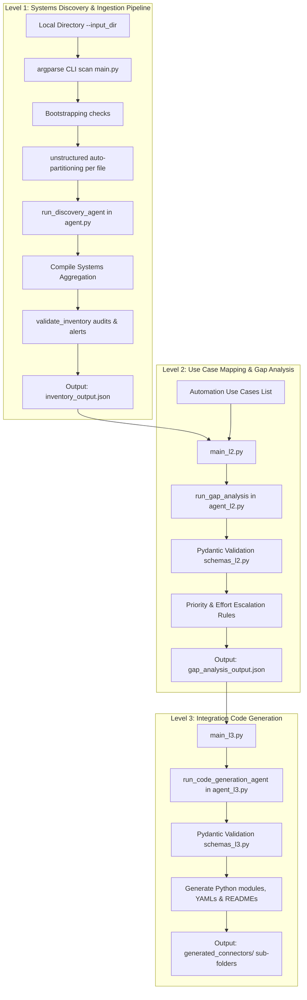

# Technical Step-by-Step Workflow Explanation (Levels 1, 2, & 3)

This document provides a highly detailed walkthrough of the **Systems Discovery Agent** codebase, explaining how the Python components, Pydantic models, and LangChain pipelines work together to automate systems discovery, gap analysis, and integration code generation.

---

## 1. High-Level Architecture Workflow

The end-to-end pipeline operates in three progressive stages, where the outputs of each level are consumed by the next:



---

## 2. Deep-Dive Level 1: Systems Ingestion & Discovery

The goal of Level 1 is to scan a target directory, partition multi-format documents, and discover systems.

### Step 1.1: Schema Ingestion and Formatting (`schemas.py`)
* **`SystemExtraction`**: Holds properties for category, authentication, criticality, confidence_score, inferred_notes, and source_reference.
* **`SystemInventory`**: Container class holding `systems: List[SystemExtraction]`.
* **Validation Rules**: Ensures non-empty strings, normalized criticality, and mandatory inference notes if the score is under 95%.

### Step 1.2: CLI Argument parsing and Bootstrapping (`main.py`)
1. Uses `argparse` to parse the input directory `--input_dir` (defaulting to `./test_documents`).
2. **Directory Bootstrapping**: If the target directory is empty or missing, the script automatically creates the directory and writes two sample files:
   - `architecture_notes.txt`: Main meeting notes.
   - `additional_systems.md`: Legacy MongoDB database notes.

### Step 1.3: Document Partitioning & Batch Processing (`main.py`)
1. Scans files in `--input_dir`.
2. Loops through files, passing each to the `unstructured` library:
   ```python
   elements = partition(filename=file_path)
   file_text = "\n".join([str(el) for el in elements])
   ```
3. Passes the extracted text to `run_discovery_agent(file_text)`.
4. **Source Metadata Tagging**: Updates `source_reference` for each returned system extraction to prepend the filename (e.g. `[additional_systems.md]`), tracking exactly where each system came from.

### Step 1.4: Aggregation & Post-Extraction Auditing (`agent.py`)
1. Aggregates all extracted systems from all documents into a single master catalog list.
2. Passes the master inventory to `validate_inventory()`.
3. Runs post-extraction validations, automatically cleaning high-confidence notes and raising explicit warnings for low confidence items (<70%).
4. Writes the master systems list to `inventory_output.json`.

---

## 3. Deep-Dive Level 2: Use Case Mapping & Gap Analysis
* The Software Architect agent (`agent_l2.py`) compares use cases against `inventory_output.json`.
* Directional data flows are traced, and gaps are classified as `Available` or `Missing`.
* Gaps involving low confidence systems are flagged as `Complex` effort.
* Gap reports are saved to `gap_analysis_output.json`, sorted by impact score.

---

## 4. Deep-Dive Level 3: Integration Code Generation
* Loads `gap_analysis_output.json` and filters out missing gaps.
* The Code Generation Agent (`agent_l3.py`) uses `with_structured_output(GeneratedIntegration)` to write runnable Python connectors, YAML definitions, and README instructions.
* Connector code implements full OAuth2/API key authentication, `tenacity` retries, rate limiting, and cursor-based pagination.
* Scripts write files into dedicated subfolders in `generated_connectors/`.
